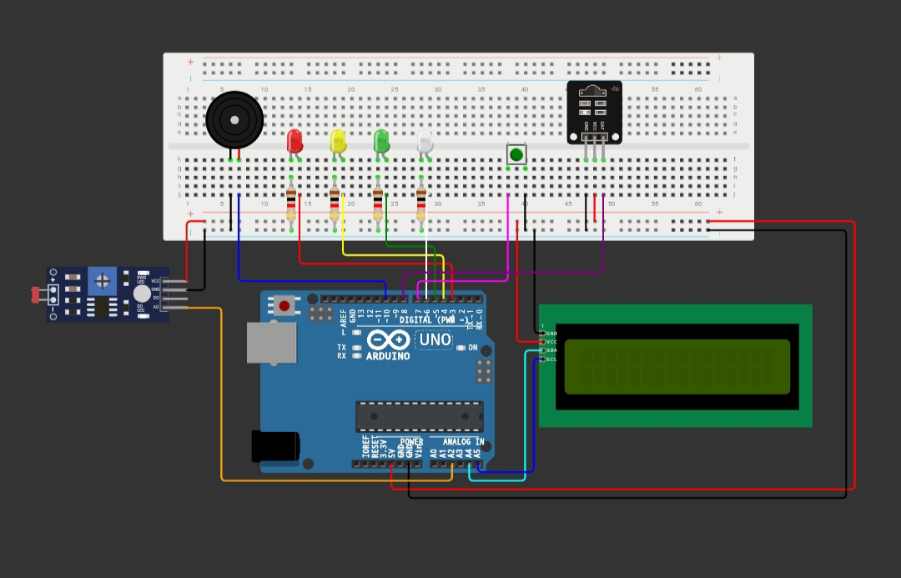

# Smart City Arduino Project

### FULL CODE
👉 [code](Arduino-Project.ino)
### Circuit Diagram

### TEST Simulation
👉 [ Wokwi Simulation](https://wokwi.com/projects/472592203542335489)
### Process 
👉 LIGHT STREET ☀️🌑  
👉 LIGHT STOP 🚏 
### PIN
PIN IN ARDUINO UNO
- LED_R PIN 3
- LED_Y PIN 4
- LED_G PIN 5
- LED_STREET PIN 6
- IR_sensor PIN 8 
- LDR_sensor PIN A2
- BUTTON PIN 7
- BUZZER PIN 10
  

